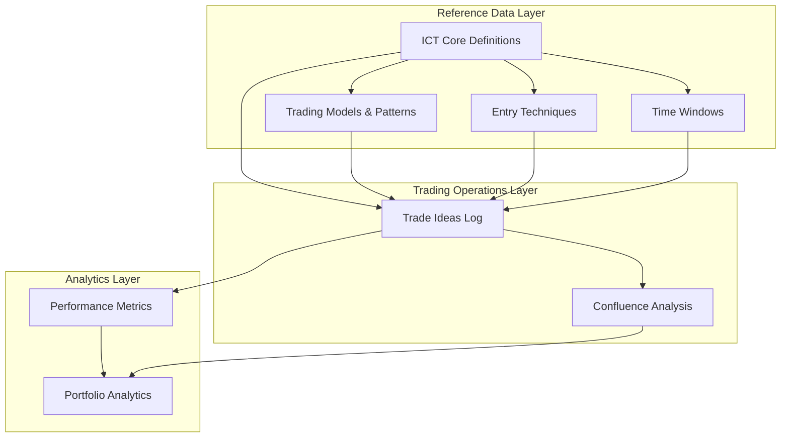

# ICT Comprehensive Database Schema
## Complete Inner Circle Trader Trading System Database

This document presents a unified, production-ready database schema that consolidates all ICT (Inner Circle Trader) concepts, models, and trading methodologies from the core reference files (`ict_core.csv` and `ict_schema_query_base.json`) into a comprehensive system for professional trading operations.

## 1. Architecture Overview



## 2. Data Sources Integration

This schema is built from two core reference files:
- **ict_core.csv**: 21+ ICT concepts with definitions, characteristics, confirmations, trading rules, mistakes, and related concepts
- **ict_schema_query_base.json**: Trading models, patterns, techniques, buy/sell models, and detailed entry procedures

## 2. Core Database Schema

### 3.1 ICT Core Definitions Table
Comprehensive catalog of all 21+ ICT concepts from ict_core.csv with exact field mappings.

```sql
-- Core ICT Concepts and Definitions (Based on ict_core.csv structure)
CREATE TABLE ict_definitions (
    concept_id              SERIAL PRIMARY KEY,
    concept_name            VARCHAR(100) NOT NULL UNIQUE,
    definition_text         TEXT NOT NULL,
    key_characteristics     TEXT NOT NULL,
    typical_confirmation    TEXT NOT NULL,
    trading_rule           TEXT NOT NULL,
    common_mistake         TEXT NOT NULL,
    related_concepts       TEXT NOT NULL,
    
    -- Extended fields for ICT detailed entries
    ict_entry_technique    TEXT,
    ict_price_action_model TEXT,
    chart_example          TEXT,
    
    -- Categorization
    concept_category       VARCHAR(50) DEFAULT 'Core ICT',
    concept_type          VARCHAR(30), -- OB, FVG, Model, Zone, etc.
    complexity_level      SMALLINT CHECK (complexity_level BETWEEN 1 AND 5) DEFAULT 3,
    
    -- Metadata
    created_at            TIMESTAMP DEFAULT NOW(),
    updated_at            TIMESTAMP DEFAULT NOW()
);

-- Performance indexes
CREATE INDEX idx_ict_definitions_name ON ict_definitions(concept_name);
CREATE INDEX idx_ict_definitions_category ON ict_definitions(concept_category);
CREATE INDEX idx_ict_definitions_type ON ict_definitions(concept_type);
CREATE INDEX idx_ict_definitions_complexity ON ict_definitions(complexity_level);
```

### 3.2 ICT Trading Models Table
All trading models from ict_schema_query_base.json including bar patterns, buy/sell models, and market structure models.

```sql
-- ICT Trading Models (From ict_schema_query_base.json)
CREATE TABLE ict_trading_models (
    model_id            SERIAL PRIMARY KEY,
    model_name          VARCHAR(100) NOT NULL UNIQUE,
    model_category      VARCHAR(50) NOT NULL, -- 'Bar Pattern', 'Buy Model', 'Sell Model', 'Market Structure'
    model_type          VARCHAR(50) NOT NULL, -- '2-Bar Reversal', 'Buy Model A', etc.
    
    -- Model Definition
    definition          TEXT NOT NULL,
    description         TEXT,
    key_characteristics TEXT NOT NULL,
    
    -- Trading Parameters
    market_bias         VARCHAR(20), -- 'Bullish', 'Bearish', 'Neutral'
    timeframe_min       VARCHAR(10), -- Minimum effective timeframe
    timeframe_max       VARCHAR(10), -- Maximum effective timeframe
    
    -- Model Steps/Process
    setup_conditions    TEXT NOT NULL,
    entry_criteria      TEXT NOT NULL,
    confirmation_rules  TEXT,
    exit_strategy       TEXT,
    
    -- Performance Metrics
    success_rate        DECIMAL(5,2), -- Historical success percentage
    risk_reward_ratio   DECIMAL(4,2), -- Average risk/reward ratio
    win_rate           DECIMAL(5,2),
    
    -- Related Information
    related_concepts    TEXT,
    common_mistakes     TEXT,
    chart_examples      TEXT,
    
    -- Metadata
    created_at          TIMESTAMP DEFAULT NOW(),
    updated_at          TIMESTAMP DEFAULT NOW()
);

-- Performance indexes
CREATE INDEX idx_trading_models_category ON ict_trading_models(model_category);
CREATE INDEX idx_trading_models_type ON ict_trading_models(model_type);
CREATE INDEX idx_trading_models_bias ON ict_trading_models(market_bias);
CREATE INDEX idx_trading_models_success ON ict_trading_models(success_rate);

### 3.3 ICT Entry Techniques Table
All entry techniques from ict_schema_query_base.json with detailed procedures and conditions.

```sql
-- ICT Entry Techniques (From ict_schema_query_base.json)
CREATE TABLE ict_entry_techniques (
    technique_id        SERIAL PRIMARY KEY,
    technique_name      VARCHAR(100) NOT NULL UNIQUE,
    technique_category  VARCHAR(50) NOT NULL, -- 'Pullback Entry', 'Reversal Entry', 'Breakout Entry'
    
    -- Technique Definition
    definition          TEXT NOT NULL,
    description         TEXT,
    key_characteristics TEXT NOT NULL,
    
    -- Entry Process
    setup_requirements  TEXT NOT NULL,
    entry_conditions    TEXT NOT NULL,
    confirmation_steps  TEXT NOT NULL,
    timing_rules        TEXT,
    
    -- Risk Management
    stop_loss_placement TEXT,
    take_profit_targets TEXT,
    position_sizing     TEXT,
    
    -- Performance Data
    success_rate        DECIMAL(5,2),
    avg_risk_reward     DECIMAL(4,2),
    optimal_timeframes  TEXT,
    
    -- Related Information
    related_models      TEXT, -- References to ict_trading_models
    related_concepts    TEXT, -- References to ict_definitions
    common_mistakes     TEXT,
    chart_examples      TEXT,
    
    -- Metadata
    created_at          TIMESTAMP DEFAULT NOW(),
    updated_at          TIMESTAMP DEFAULT NOW()
);

-- Performance indexes
CREATE INDEX idx_entry_techniques_category ON ict_entry_techniques(technique_category);
CREATE INDEX idx_entry_techniques_success ON ict_entry_techniques(success_rate);
CREATE INDEX idx_entry_techniques_name ON ict_entry_techniques(technique_name);
```

### 3.4 ICT Pattern Recognition Table
Specific patterns and setups that can be identified and tracked across different timeframes.

```sql
-- ICT Patterns and Setups
CREATE TABLE ict_patterns (
    pattern_id          SERIAL PRIMARY KEY,
    pattern_name        VARCHAR(100) NOT NULL UNIQUE,
    pattern_category    VARCHAR(50) NOT NULL, -- 'Reversal', 'Continuation', 'Accumulation', 'Distribution'
    
    -- Pattern Definition
    definition          TEXT NOT NULL,
    description         TEXT,
    key_characteristics TEXT NOT NULL,
    
    -- Pattern Recognition
    identification_rules TEXT NOT NULL,
    confirmation_criteria TEXT NOT NULL,
    invalidation_rules   TEXT,
    
    -- Trading Application
    optimal_timeframes   TEXT,
    market_conditions    TEXT, -- Trending, Ranging, Volatile
    success_probability  DECIMAL(5,2),
    
    -- Relationships
    related_models       TEXT, -- References to ict_trading_models
    related_techniques   TEXT, -- References to ict_entry_techniques
    related_concepts     TEXT, -- References to ict_definitions
    
    -- Examples and Documentation
    chart_examples       TEXT,
    common_mistakes      TEXT,
    notes               TEXT,
    
    -- Metadata
    created_at          TIMESTAMP DEFAULT NOW(),
    updated_at          TIMESTAMP DEFAULT NOW()
);

-- Performance indexes
CREATE INDEX idx_patterns_category ON ict_patterns(pattern_category);
CREATE INDEX idx_patterns_success ON ict_patterns(success_probability);
CREATE INDEX idx_patterns_name ON ict_patterns(pattern_name);
```

### 3.5 ICT Time Windows and Sessions Table
Kill zones, silver bullets, macro times, and session timing from ICT methodology.

```sql
-- ICT Time Windows and Sessions
CREATE TABLE ict_time_windows (
    window_id           SERIAL PRIMARY KEY,
    window_name         VARCHAR(50) NOT NULL UNIQUE,
    window_type         VARCHAR(30) NOT NULL, -- 'Kill Zone', 'Silver Bullet', 'Macro Time', 'Session'
    
    -- Timing Details
    session             VARCHAR(20) NOT NULL, -- 'London', 'New York', 'Asian', 'Frankfurt'
    start_time          TIME NOT NULL,
    end_time            TIME NOT NULL,
    timezone            VARCHAR(10) DEFAULT 'EST',
    
    -- Window Characteristics
    description         TEXT,
    probability_rating  SMALLINT CHECK (probability_rating BETWEEN 1 AND 5),
    optimal_pairs       TEXT,
    market_conditions   TEXT, -- 'Trending', 'Ranging', 'High Volatility'
    
    -- Performance Data
    success_rate        DECIMAL(5,2),
    avg_move_points     DECIMAL(8,2),
    frequency          VARCHAR(20), -- 'Daily', 'Weekly', 'Monthly'
    
    -- Documentation
    notes              TEXT,
    chart_examples     TEXT,
    
    -- Status
    is_active          BOOLEAN DEFAULT TRUE,
    
    -- Metadata
    created_at         TIMESTAMP DEFAULT NOW(),
    updated_at         TIMESTAMP DEFAULT NOW()
);

-- Performance indexes
CREATE INDEX idx_time_windows_type ON ict_time_windows(window_type);
CREATE INDEX idx_time_windows_session ON ict_time_windows(session);
CREATE INDEX idx_time_windows_active ON ict_time_windows(is_active);
CREATE INDEX idx_time_windows_rating ON ict_time_windows(probability_rating);
```
### 3.6 Enhanced Trade Tracking System
Comprehensive trade logging with all ICT confluence factors, model types, and performance metrics.

```sql
-- Enhanced Trade Ideas and Execution Log
CREATE TABLE ict_trades (
    trade_id                SERIAL PRIMARY KEY,
    
    -- Basic Trade Information
    asset                   VARCHAR(10) NOT NULL,
    trade_direction         VARCHAR(5) NOT NULL CHECK (trade_direction IN ('LONG', 'SHORT')),
    trade_status           VARCHAR(15) DEFAULT 'SETUP' CHECK (trade_status IN ('SETUP', 'ENTERED', 'PARTIAL', 'CLOSED', 'CANCELLED')),
    
    -- Market Bias Analysis
    bias_htf               VARCHAR(10) NOT NULL, -- Higher timeframe bias
    bias_ltf               VARCHAR(10) NOT NULL, -- Lower timeframe bias
    timeframe_htf          VARCHAR(5) NOT NULL,  -- Analysis timeframe
    timeframe_ltf          VARCHAR(5) NOT NULL,  -- Entry timeframe
    
    -- ICT Model and Technique References
    trading_model_id       INT REFERENCES ict_trading_models(model_id),
    entry_technique_id     INT REFERENCES ict_entry_techniques(technique_id),
    pattern_id             INT REFERENCES ict_patterns(pattern_id),
    time_window_id         INT REFERENCES ict_time_windows(window_id),
    
    -- ICT Concepts Applied
    order_block_type       VARCHAR(30), -- 'Bullish OB', 'Bearish OB', 'Breaker Block'
    fvg_type              VARCHAR(30), -- 'Bullish FVG', 'Bearish FVG', 'Void'
    liquidity_type        VARCHAR(30), -- 'BSL', 'SSL', 'EQH', 'EQL'
    pd_array_level        VARCHAR(20), -- 'Premium', 'Discount', 'Equilibrium'
    pd_array_percentage   DECIMAL(5,2), -- Exact percentage level
    
    -- Market Structure Analysis
    market_structure      VARCHAR(30), -- 'BOS', 'CHoCH', 'SMS', 'Continuation'
    displacement_present  BOOLEAN DEFAULT FALSE,
    displacement_type     VARCHAR(20), -- 'Strong', 'Weak'
    liquidity_sweep       VARCHAR(30), -- Type of liquidity taken
    smt_divergence        VARCHAR(20), -- 'Type 1', 'Type 2', 'None'
    
    -- Price Levels and Risk Management
    entry_price           DECIMAL(12,6),
    stop_loss             DECIMAL(12,6) NOT NULL,
    take_profit_1         DECIMAL(12,6),
    take_profit_2         DECIMAL(12,6),
    take_profit_3         DECIMAL(12,6),
    
    -- Position Sizing and Risk
    risk_percent          DECIMAL(5,2) NOT NULL, -- % of account risked
    position_size         DECIMAL(15,4),
    risk_reward_ratio     DECIMAL(6,2),
    
    -- Confluence Analysis
    confluence_score      SMALLINT NOT NULL CHECK (confluence_score BETWEEN 0 AND 20),
    confluence_factors    TEXT, -- JSON array of all confluence factors
    star_rating          SMALLINT CHECK (star_rating BETWEEN 1 AND 5),
    
    -- Timing Information
    setup_time           TIMESTAMP NOT NULL,
    entry_time           TIMESTAMP,
    exit_time            TIMESTAMP,
    
    -- Performance Tracking
    pnl_points           DECIMAL(10,4),
    pnl_percent          DECIMAL(8,2),
    pnl_dollar           DECIMAL(12,2),
    max_favorable_excursion DECIMAL(10,4), -- MFE
    max_adverse_excursion   DECIMAL(10,4), -- MAE
    
    -- Trade Quality Metrics
    execution_quality    SMALLINT CHECK (execution_quality BETWEEN 1 AND 5),
    setup_quality        SMALLINT CHECK (setup_quality BETWEEN 1 AND 5),
    timing_quality       SMALLINT CHECK (timing_quality BETWEEN 1 AND 5),
    
    -- Documentation and Learning
    chart_screenshot     TEXT, -- File path or URL
    pre_trade_analysis   TEXT,
    post_trade_review    TEXT,
    lessons_learned      TEXT,
    mistakes_made        TEXT,
    
    -- Metadata
    created_at           TIMESTAMP DEFAULT NOW(),
    updated_at           TIMESTAMP DEFAULT NOW()
);

-- Performance indexes for trade tracking
CREATE INDEX idx_trades_asset ON ict_trades(asset);
CREATE INDEX idx_trades_status ON ict_trades(trade_status);
CREATE INDEX idx_trades_model ON ict_trades(trading_model_id);
CREATE INDEX idx_trades_technique ON ict_trades(entry_technique_id);
CREATE INDEX idx_trades_pattern ON ict_trades(pattern_id);
CREATE INDEX idx_trades_date ON ict_trades(setup_time);
CREATE INDEX idx_trades_performance ON ict_trades(pnl_percent) WHERE pnl_percent IS NOT NULL;
CREATE INDEX idx_trades_confluence ON ict_trades(confluence_score);
CREATE INDEX idx_trades_rating ON ict_trades(star_rating);
```

## 4. Performance Analytics and Views
Comprehensive performance tracking, analysis views, and reporting capabilities.

### 4.1 Performance Analytics Views

```sql
-- Overall Performance Summary
CREATE VIEW ict_performance_summary AS
SELECT
    COUNT(*) as total_trades,
    COUNT(CASE WHEN pnl_percent > 0 THEN 1 END) as winning_trades,
    COUNT(CASE WHEN pnl_percent < 0 THEN 1 END) as losing_trades,
    ROUND(
        COUNT(CASE WHEN pnl_percent > 0 THEN 1 END)::NUMERIC / 
        NULLIF(COUNT(CASE WHEN pnl_percent IS NOT NULL THEN 1 END), 0) * 100, 2
    ) as win_rate_percent,
    ROUND(AVG(pnl_percent), 2) as avg_return_percent,
    ROUND(STDDEV(pnl_percent), 2) as return_std_dev,
    ROUND(MAX(pnl_percent), 2) as best_trade_percent,
    ROUND(MIN(pnl_percent), 2) as worst_trade_percent,
    ROUND(
        SUM(CASE WHEN pnl_percent > 0 THEN pnl_percent ELSE 0 END) / 
        NULLIF(ABS(SUM(CASE WHEN pnl_percent < 0 THEN pnl_percent ELSE 0 END)), 0), 2
    ) as profit_factor,
    ROUND(AVG(risk_reward_ratio), 2) as avg_risk_reward,
    ROUND(AVG(confluence_score), 1) as avg_confluence_score
FROM ict_trades 
WHERE trade_status = 'CLOSED' AND pnl_percent IS NOT NULL;

-- Performance by Trading Model
CREATE VIEW ict_performance_by_model AS
SELECT
    tm.model_name,
    tm.model_category,
    COUNT(*) as trade_count,
    ROUND(AVG(t.pnl_percent), 2) as avg_return,
    ROUND(
        COUNT(CASE WHEN t.pnl_percent > 0 THEN 1 END)::NUMERIC / 
        COUNT(*) * 100, 2
    ) as win_rate,
    ROUND(
        SUM(CASE WHEN t.pnl_percent > 0 THEN t.pnl_percent ELSE 0 END) / 
        NULLIF(ABS(SUM(CASE WHEN t.pnl_percent < 0 THEN t.pnl_percent ELSE 0 END)), 0), 2
    ) as profit_factor,
    ROUND(AVG(t.star_rating), 1) as avg_rating,
    ROUND(AVG(t.confluence_score), 1) as avg_confluence
FROM ict_trades t
JOIN ict_trading_models tm ON t.trading_model_id = tm.model_id
WHERE t.trade_status = 'CLOSED' AND t.pnl_percent IS NOT NULL
GROUP BY tm.model_id, tm.model_name, tm.model_category
ORDER BY avg_return DESC;

-- Performance by Entry Technique
CREATE VIEW ict_performance_by_technique AS
SELECT
    et.technique_name,
    et.technique_category,
    COUNT(*) as trade_count,
    ROUND(AVG(t.pnl_percent), 2) as avg_return,
    ROUND(
        COUNT(CASE WHEN t.pnl_percent > 0 THEN 1 END)::NUMERIC / 
        COUNT(*) * 100, 2
    ) as win_rate,
    ROUND(AVG(t.risk_reward_ratio), 2) as avg_risk_reward,
    ROUND(AVG(t.execution_quality), 1) as avg_execution_quality
FROM ict_trades t
JOIN ict_entry_techniques et ON t.entry_technique_id = et.technique_id
WHERE t.trade_status = 'CLOSED' AND t.pnl_percent IS NOT NULL
GROUP BY et.technique_id, et.technique_name, et.technique_category
ORDER BY avg_return DESC;

-- Performance by Time Window
CREATE VIEW ict_performance_by_time AS
SELECT
    tw.window_name,
    tw.window_type,
    tw.session,
    COUNT(*) as trade_count,
    ROUND(AVG(t.pnl_percent), 2) as avg_return,
    ROUND(
        COUNT(CASE WHEN t.pnl_percent > 0 THEN 1 END)::NUMERIC / 
        COUNT(*) * 100, 2
    ) as win_rate,
    ROUND(AVG(t.confluence_score), 1) as avg_confluence,
    ROUND(AVG(t.timing_quality), 1) as avg_timing_quality
FROM ict_trades t
JOIN ict_time_windows tw ON t.time_window_id = tw.window_id
WHERE t.trade_status = 'CLOSED' AND t.pnl_percent IS NOT NULL
GROUP BY tw.window_id, tw.window_name, tw.window_type, tw.session
ORDER BY avg_return DESC;

-- Confluence Analysis View
CREATE VIEW ict_confluence_analysis AS
SELECT
    confluence_score,
    COUNT(*) as trade_count,
    ROUND(AVG(pnl_percent), 2) as avg_return,
    ROUND(
        COUNT(CASE WHEN pnl_percent > 0 THEN 1 END)::NUMERIC / 
        COUNT(*) * 100, 2
    ) as win_rate,
    ROUND(AVG(risk_reward_ratio), 2) as avg_risk_reward
FROM ict_trades
WHERE trade_status = 'CLOSED' AND pnl_percent IS NOT NULL
GROUP BY confluence_score
ORDER BY confluence_score DESC;

-- Asset Performance Analysis
CREATE VIEW ict_performance_by_asset AS
SELECT
    asset,
    COUNT(*) as trade_count,
    ROUND(AVG(pnl_percent), 2) as avg_return,
    ROUND(
        COUNT(CASE WHEN pnl_percent > 0 THEN 1 END)::NUMERIC / 
        COUNT(*) * 100, 2
    ) as win_rate,
    ROUND(SUM(pnl_dollar), 2) as total_pnl,
    ROUND(AVG(max_favorable_excursion), 2) as avg_mfe,
    ROUND(AVG(max_adverse_excursion), 2) as avg_mae
FROM ict_trades
WHERE trade_status = 'CLOSED' AND pnl_percent IS NOT NULL
GROUP BY asset
ORDER BY total_pnl DESC;
```

### 4.2 Advanced Analytics Functions

```sql
-- Function to calculate Sharpe Ratio
CREATE OR REPLACE FUNCTION calculate_sharpe_ratio(
    risk_free_rate DECIMAL DEFAULT 0.02
) RETURNS DECIMAL AS $$
DECLARE
    avg_return DECIMAL;
    std_dev DECIMAL;
    sharpe_ratio DECIMAL;
BEGIN
    SELECT AVG(pnl_percent), STDDEV(pnl_percent)
    INTO avg_return, std_dev
    FROM ict_trades
    WHERE trade_status = 'CLOSED' AND pnl_percent IS NOT NULL;
    
    IF std_dev > 0 THEN
        sharpe_ratio := (avg_return - risk_free_rate) / std_dev;
    ELSE
        sharpe_ratio := 0;
    END IF;
    
    RETURN ROUND(sharpe_ratio, 4);
END;
$$ LANGUAGE plpgsql;

-- Function to calculate Maximum Drawdown
CREATE OR REPLACE FUNCTION calculate_max_drawdown() RETURNS DECIMAL AS $$
DECLARE
    max_dd DECIMAL := 0;
    running_total DECIMAL := 0;
    peak DECIMAL := 0;
    current_dd DECIMAL;
    trade_record RECORD;
BEGIN
    FOR trade_record IN 
        SELECT pnl_percent 
        FROM ict_trades 
        WHERE trade_status = 'CLOSED' AND pnl_percent IS NOT NULL 
        ORDER BY exit_time
    LOOP
        running_total := running_total + trade_record.pnl_percent;
        
        IF running_total > peak THEN
            peak := running_total;
        END IF;
        
        current_dd := peak - running_total;
        
        IF current_dd > max_dd THEN
            max_dd := current_dd;
        END IF;
    END LOOP;
    
    RETURN ROUND(max_dd, 2);
END;
$$ LANGUAGE plpgsql;
```
-- Confluence Performance Analysis View
CREATE VIEW ict_confluence_performance AS
SELECT
    confluence_score,
    COUNT(*) as trade_count,
    ROUND(AVG(pnl_percent), 2) as avg_return,
    ROUND(
        COUNT(CASE WHEN pnl_percent > 0 THEN 1 END)::NUMERIC / 
        COUNT(*) * 100, 2
    ) as win_rate,
    ROUND(MAX(pnl_percent), 2) as best_trade,
    ROUND(MIN(pnl_percent), 2) as worst_trade,
    ROUND(AVG(risk_reward_ratio), 2) as avg_risk_reward
FROM ict_trades
WHERE trade_status = 'CLOSED' AND pnl_percent IS NOT NULL
GROUP BY confluence_score
ORDER BY confluence_score DESC;

-- Sample Data Population
## 6. Sample Data Population

### 6.1 Core ICT Definitions
Based on ict_core.csv structure and ICT methodology.

```sql
-- Insert core ICT concepts
INSERT INTO ict_definitions (concept_name, definition_text, key_characteristics, typical_confirmation, trading_rule, common_mistake, related_concepts, concept_category, concept_type, complexity_level) VALUES

-- Order Block
('Order Block', 'A price level where institutional orders are placed, creating significant support or resistance zones', 'Strong rejection at level, High volume node, Clear structure break before formation', 'Price rejection with wicks, Volume spike confirmation, Mitigation through the block', 'Wait for mitigation, Use proper risk management, Confirm with higher timeframe bias', 'Entering too early before mitigation, Ignoring higher timeframe context, Poor risk management', 'Fair Value Gap, Breaker Block, Mitigation Block, Liquidity Pool', 'Price Action', 'Support/Resistance', 3),

-- Fair Value Gap
('Fair Value Gap', 'An imbalance in price where one candle body does not overlap with previous or next candle bodies', 'Clear gap in price action, No overlapping bodies, Often gets filled later', 'Gap formation on strong move, Volume confirmation, Directional bias alignment', 'Trade gap fills at 62-79% retracement, Use as support/resistance, Combine with other confluences', 'Trading every gap without context, Ignoring market structure, Poor timing on entries', 'Order Block, Liquidity Void, Imbalance, Premium/Discount Arrays', 'Price Action', 'Imbalance', 2),

-- Break of Structure
('Break of Structure', 'When price breaks a significant swing high or low, indicating potential change in market direction', 'Clear break of previous structure, Volume confirmation, Follow-through momentum', 'Structure break with volume, Momentum continuation, No immediate pullback', 'Wait for confirmation candle, Trade pullbacks after BOS, Manage risk properly', 'False breakouts, Entering too early, Ignoring overall context', 'Change of Character, Market Structure, Liquidity Sweep, Displacement', 'Market Structure', 'Trend Change', 3),

-- Change of Character
('Change of Character', 'A shift in market behavior indicating potential reversal or continuation pattern', 'Momentum shift visible, Structure change, Volume pattern changes', 'Momentum divergence, Structure break, Volume confirmation', 'Identify early signs, Prepare for reversal, Use proper confirmation', 'Premature entries, Ignoring confirmation signals, Poor risk management', 'Break of Structure, Market Structure, Displacement, Smart Money Concepts', 'Market Structure', 'Trend Change', 4),

-- Liquidity Sweep
('Liquidity Sweep', 'When price moves to take out stops above/below key levels before reversing direction', 'Quick move to liquidity, Immediate reversal, High volume spike', 'Stop hunt completion, Reversal confirmation, Volume spike on sweep', 'Wait for sweep completion, Enter on reversal confirmation, Use tight stops', 'Entering during the sweep, Poor timing, Inadequate confirmation', 'Stop Hunt, Liquidity Pool, False Breakout, Order Block', 'Liquidity', 'Stop Hunt', 4),

-- Premium/Discount Arrays
('Premium/Discount Arrays', 'Fibonacci-based value zones where Premium is 70-100% and Discount is 0-30%', 'Clear percentage levels, Optimal entry zones, Risk/reward optimization', 'Price in correct PD array, Confluence with other factors, Proper risk/reward', 'Enter in discount for longs, premium for shorts, Use for position sizing', 'Entering outside optimal zones, Ignoring PD array context', 'Optimal Trade Entry, Fair Value Gap, Order Block', 'Value Zones', 'Entry Optimization', 2),

-- Kill Zone
('Kill Zone', 'High-probability trading windows during specific market sessions', 'Specific time windows, High volatility periods, Institutional activity', 'Time-based confirmation, Increased volatility, Clear directional moves', 'Trade only during kill zones, Wait for optimal timing, Use session bias', 'Trading outside optimal windows, Ignoring session characteristics', 'Silver Bullet, Macro Times, Session Analysis', 'Timing', 'Session Analysis', 2),

-- Silver Bullet
('Silver Bullet', 'Precision 20-minute window for high-probability trade execution', 'Exact timing window, Algorithmic price moves, High success rate', 'Precise timing alignment, Strong directional move, Volume confirmation', 'Enter only during silver bullet time, Use tight execution, Manage risk strictly', 'Missing the timing window, Poor execution, Inadequate preparation', 'Kill Zone, Macro Times, Precision Trading', 'Timing', 'Precision Entry', 3),

-- Displacement
('Displacement', 'Strong impulsive move indicating institutional participation and market direction', 'Sudden strong price move, High volume, Clear direction', 'Strong momentum candle, Volume spike, Follow-through', 'Use as trend confirmation, Enter on pullbacks, Follow displacement direction', 'Missing displacement signals, Counter-trend trading, Poor follow-through', 'Order Block, Market Structure, Institutional Flow', 'Institutional Flow', 'Momentum', 3),

-- Optimal Trade Entry
('Optimal Trade Entry', 'Fibonacci 61.8%-79% retracement zone for precision entries with 70.5% being optimal', 'Specific percentage levels, High probability zone, Risk/reward optimization', 'OTE level alignment, Confluence with FVG/OB, Proper market structure', 'Enter at 70.5% optimal level, Combine with other confluences, Use for precision', 'Entering outside OTE zone, Ignoring confluence factors, Poor timing', 'Fair Value Gap, Order Block, Premium/Discount Arrays', 'Entry Models', 'Precision Entry', 3);

-- Insert Trading Models
INSERT INTO ict_trading_models (model_name, model_category, model_type, definition, key_characteristics, setup_conditions, entry_criteria, confirmation_rules, exit_strategy, success_rate, risk_reward_ratio) VALUES

('AMD Model', 'Market Models', 'Session Model', 'Accumulation → Manipulation → Distribution three-phase model', 'Three distinct phases, Time-based structure, Institutional flow', 'Clear session start, Market structure setup, Bias established', 'Phase alignment, Confluence factors present, Proper timing', 'Volume confirmation, Structure break, Momentum follow-through', 'Target next phase, Trail stops, Partial profits', 68.5, 2.8),

('PO3 Model', 'Market Models', 'Session Model', 'Consolidation → Manipulation → Trend three-phase expansion', 'Power of Three phases, Expansion after manipulation, Clear structure', 'Consolidation phase identified, Manipulation setup, Trend bias clear', 'Manipulation completion, Trend phase entry, Confluence alignment', 'Break of consolidation, Volume increase, Momentum confirmation', 'Trend targets, Trail stops, Multiple exits', 72.3, 3.1),

('2-Bar Reversal', 'Bar Patterns', 'Reversal Pattern', 'Two-candle reversal pattern indicating potential trend change', 'Two specific candles, Reversal formation, Volume confirmation', 'Clear trend established, Key level interaction, Reversal setup', 'Second bar closes opposite to trend, Confirmation present', 'Volume spike, Follow-through candle, Structure break', 'Previous structure target, Trail stops, Risk management', 65.2, 2.4),

('3-Bar Reversal', 'Bar Patterns', 'Reversal Pattern', 'Three-candle reversal pattern with higher probability than 2-bar', 'Three candle sequence, Higher probability, Multiple confirmations', 'Established trend, Key level, Multiple confluence factors', 'Third bar confirms reversal, Volume support present', 'Multiple confirmations, Structure break, Momentum shift', 'Multiple targets, Partial profits, Trail stops', 71.8, 2.9),

('Buy Model A', 'Buy Models', 'Bullish Setup', 'Order Block pullback with Fair Value Gap fill for long entries', 'Bullish bias, Order block present, FVG alignment', 'Bullish market structure, Order block identified, FVG present', 'Pullback to OB level, FVG fill, Confirmation signals', 'Rejection at OB, Volume confirmation, Structure alignment', 'Liquidity targets, Trail stops, Partial exits', 74.1, 3.3),

('Sell Model A', 'Sell Models', 'Bearish Setup', 'Bearish Order Block pullback for short entries', 'Bearish bias, Bearish order block, Structure break', 'Bearish market structure, Order block formation, Break confirmed', 'Pullback to OB level, Rejection confirmation, Entry trigger', 'Volume confirmation, Follow-through, Structure alignment', 'Support level targets, Risk management, Trail stops', 69.7, 2.9);

-- Insert Entry Techniques
INSERT INTO ict_entry_techniques (technique_name, technique_category, definition, key_characteristics, setup_requirements, entry_conditions, confirmation_steps, stop_loss_placement, take_profit_targets, success_rate, avg_risk_reward) VALUES

('Order Block Mitigation Entry', 'Pullback Entry', 'Entry technique using order block mitigation for precision entries', 'Order block present, Mitigation setup, Confluence factors', 'Valid order block, Market structure alignment, Proper bias', 'Price reaches OB level, Mitigation begins, Confirmation present', 'Rejection at OB, Volume confirmation, Follow-through', 'Beyond order block, Risk management, Proper placement', 'Liquidity levels, Structure targets, Multiple exits', 73.2, 3.1),

('Fair Value Gap Fill Entry', 'Retracement Entry', 'Entry using fair value gap fill for optimal risk/reward', 'FVG present, Fill setup, Directional bias', 'Valid FVG, Market structure support, Bias alignment', 'Price approaches FVG, Fill begins, Confirmation signals', 'Partial fill, Volume confirmation, Rejection', 'Beyond FVG, Proper risk, Structure-based', 'Previous structure, Extension targets, Partials', 68.9, 2.8),

('Break of Structure Pullback', 'Continuation Entry', 'Entry on pullback after confirmed break of structure', 'BOS confirmed, Pullback setup, Trend continuation', 'Clear BOS, Structure break, Pullback formation', 'Pullback to key level, Support/resistance, Entry trigger', 'Level hold, Volume confirmation, Continuation signal', 'Below pullback level, Structure-based, Risk management', 'Extension targets, Trend continuation, Trail stops', 71.5, 3.0),

('Liquidity Sweep Entry', 'Reversal Entry', 'Entry after liquidity sweep completion and reversal confirmation', 'Liquidity sweep, Reversal setup, High probability', 'Liquidity identified, Sweep setup, Reversal potential', 'Sweep completion, Reversal begins, Confirmation present', 'Reversal confirmation, Volume spike, Follow-through', 'Beyond sweep level, Tight stops, Quick invalidation', 'Opposite liquidity, Reversal targets, Quick profits', 76.3, 3.4);

-- Insert Time Windows
INSERT INTO ict_time_windows (window_name, window_type, session, start_time, end_time, timezone, description, probability_rating, optimal_pairs, success_rate) VALUES

('London Kill Zone', 'Kill Zone', 'London', '02:00:00', '05:00:00', 'EST', 'European session high-probability trading window', 4, 'GBPUSD, EURUSD, GBPJPY, EURGBP', 72.5),
('New York Kill Zone', 'Kill Zone', 'New York', '07:00:00', '10:00:00', 'EST', 'NY opening high-probability window with strong moves', 5, 'EURUSD, GBPUSD, USDCAD, USDCHF', 78.2),
('Silver Bullet', 'Silver Bullet', 'New York', '10:00:00', '11:00:00', 'EST', '20-minute precision window for algorithmic moves', 5, 'All major pairs', 81.7),
('Asian Range', 'Consolidation', 'Asian', '20:00:00', '02:00:00', 'EST', 'Range-bound Asian session with lower volatility', 2, 'USDJPY, AUDUSD, NZDUSD', 45.3),
('Lunch Time', 'Low Probability', 'New York', '11:00:00', '13:30:00', 'EST', 'Low activity consolidation period', 2, 'Limited trading recommended', 38.9),
('NY PM Session', 'Kill Zone', 'New York', '13:30:00', '16:00:00', 'EST', 'Afternoon continuation or reversal window', 4, 'EURUSD, GBPUSD, USDCAD', 69.8);
```

### 2.8 Equity Curve Tracking
Portfolio performance over time.

```sql
-- Equity Curve Tracking
CREATE TABLE ict_equity_curve (
    curve_id            SERIAL PRIMARY KEY,
    trade_id            INT REFERENCES ict_trade_ideas(trade_id),
    date_time           TIMESTAMP NOT NULL,
    running_pnl_percent NUMERIC(10,4) NOT NULL,
    running_pnl_dollar  NUMERIC(15,2) NOT NULL,
    account_balance     NUMERIC(15,2) NOT NULL,
    drawdown_percent    NUMERIC(8,4),
    new_equity_high     BOOLEAN DEFAULT FALSE,
    trade_sequence      INT NOT NULL
);

-- Drawdown Analysis
CREATE VIEW ict_drawdown_analysis AS
WITH equity_highs AS (
    SELECT 
        curve_id,
        date_time,
        account_balance,
        MAX(account_balance) OVER (ORDER BY date_time ROWS UNBOUNDED PRECEDING) as running_high
    FROM ict_equity_curve
)
SELECT
    MAX((running_high - account_balance) / running_high * 100) as max_drawdown_percent,
    AVG((running_high - account_balance) / running_high * 100) as avg_drawdown_percent,
    COUNT(CASE WHEN account_balance < running_high THEN 1 END) as drawdown_periods
FROM equity_highs;
```

## 3. Sample Data Population

### 3.1 ICT Definitions Data
```sql
-- Insert core ICT concepts
INSERT INTO ict_definitions (concept_name, category, definition_text, key_characteristics, typical_confirmation, trading_rule, common_mistake, related_concepts, video_source) VALUES
('Order Block', 'Price Action', 'Institutional price zone of last opposing candle before a directional move', 'Last candle before move, Zone of heavy institutional order flow', 'OB in line with HTF bias', 'Enter at OB after sweep', 'Mistaking any support/resistance as OB', 'Liquidity Sweep, FVG', 'ICT 2022 Mentorship Episode 7'),
('Fair Value Gap', 'Price Imbalance', 'Price imbalance/inefficiency that seeks rebalancing', 'Three candles with gap, No trading in gap area', 'FVG aligned with OB', 'Target retracement 62-79%', 'Over-trading gaps', 'OB, Liquidity Void', 'ICT 2022 Mentorship Episode 5'),
('Liquidity Pool', 'Liquidity', 'Cluster of stop-losses or large orders institutions target', 'High volume nodes, Often near prior swing highs/lows', 'Liquidity pool near OB or FVG', 'Place stop beyond pool', 'Ignoring pool placement', 'Order Block, Sweep', 'ICT 2022 Mentorship Episode 4'),
('Premium/Discount Array', 'Value Zones', 'Value-based pricing zones (0-30% discount, 70-100% premium)', 'Defines ideal entry zones', 'Entry within correct PD range', 'Use PD for risk sizing', 'Entering outside PD', 'OB, FVG', 'ICT 2022 Mentorship Episode 6'),
('Market Structure', 'Trend Analysis', 'Higher highs/lows, BOS, CHoCH', 'Determines bias', 'Break of structure confirms bias', 'Align trades with new structure', 'Misreading structure', 'AMD, PO3', 'ICT 2022 Mentorship Episode 3'),
('Kill Zone', 'Timing', 'High-probability trading windows (London, NY, Asian)', 'Specific time windows', 'Trade only in kill zone', 'Wait for kill zone', 'Trading outside window', 'Macro Times', 'ICT 2022 Mentorship Episode 8'),
('Silver Bullet', 'Precision Timing', '20-minute precision window for high-prob trades', 'Specific minutes in session', 'Align entry with silver bullet', 'Tight timing', 'Mis-timed entry', 'Kill Zone', 'ICT Silver Bullet Series'),
('Displacement', 'Institutional Flow', 'Strong impulsive move indicating institutional activity', 'Sudden price move', 'Use as trend confirmation', 'Enter on displacement', 'Missing displacement', 'OB', 'ICT 2022 Mentorship Episode 5'),
('Liquidity Sweep', 'Market Manipulation', 'False break to trigger stops before reversal', 'Sharp move then reversal', 'Enter after sweep', 'Use for entry', 'Ignoring sweep', 'Liquidity Pool', 'ICT 2022 Mentorship Episode 9'),
('Optimal Trade Entry', 'Entry Models', 'Fibonacci 61.8%-79% retracement zone for precision entries', '70.5% is optimal level', 'OTE aligns with FVG/OB', 'Enter at 70.5% level', 'Entering outside OTE', 'FVG, OB', 'ICT 2022 Mentorship Episode 6');

-- Insert market models
INSERT INTO ict_models (model_name, description, typical_phases, phase_count, session_start, session_end, optimal_timeframes) VALUES
('AMD Model', 'Accumulation → Manipulation → Distribution', 'Phase 1: Accumulation (02:00-05:00), Phase 2: Manipulation (05:00-08:00), Phase 3: Distribution (08:00-11:00)', 3, '02:00', '11:00', '1H, 15M'),
('PO3 Model', 'Consolidation → Manipulation → Trend', 'Phase 1: Consolidation, Phase 2: Manipulation, Phase 3: Trend', 3, '07:00', '16:00', '4H, 1H'),
('Judas Swing', 'False move in first 30-60 min of session to trap retail', 'Early session reversal pattern', 1, '07:30', '08:30', '15M, 5M'),
('Silver Bullet', 'Precision 20-minute execution window', 'Single high-probability window', 1, '10:00', '11:00', '5M, 1M'),
('London Open', 'European session opening dynamics', 'Initial bias establishment', 1, '02:00', '05:00', '1H, 15M'),
('New York AM', 'Morning session institutional flow', 'AM session bias and execution', 1, '08:30', '11:30', '15M, 5M'),
('New York PM', 'Afternoon session continuation or reversal', 'PM session dynamics', 1, '13:30', '16:00', '15M, 5M');

-- Insert time windows
INSERT INTO ict_time_windows (window_name, window_type, session, start_time, end_time, description, probability_rating) VALUES
('London Kill Zone', 'Kill Zone', 'London', '02:00', '05:00', 'European session high-probability window', 4),
('New York Kill Zone', 'Kill Zone', 'New York', '07:00', '10:00', 'NY opening high-probability window', 5),
('Silver Bullet', 'Silver Bullet', 'New York', '10:00', '11:00', '20-minute precision window', 5),
('Lunch Time', 'Low Probability', 'New York', '11:00', '13:30', 'Low activity consolidation period', 2),
('NY PM Session', 'Kill Zone', 'New York', '13:30', '16:00', 'Afternoon continuation window', 4),
('Asian Range', 'Consolidation', 'Asian', '18:00', '02:00', 'Range-bound Asian session', 2);

-- Insert confluence factors
INSERT INTO ict_confluence_factors (factor_name, factor_category, weight_value, description) VALUES
('HTF Bias Alignment', 'Structure', 2.0, 'Entry aligns with higher timeframe bias'),
('Order Block Present', 'Price Action', 1.5, 'Valid order block at entry zone'),
('Fair Value Gap', 'Price Imbalance', 1.5, 'FVG present for entry'),
('Liquidity Sweep', 'Manipulation', 2.0, 'Recent liquidity sweep occurred'),
('Kill Zone Timing', 'Timing', 1.5, 'Entry during high-probability time window'),
('PD Array Discount', 'Value', 1.0, 'Entry in discount array (0-30%)'),
('PD Array Premium', 'Value', 1.0, 'Entry in premium array (70-100%)'),
('Market Structure BOS', 'Structure', 1.5, 'Break of structure confirmed'),
('Displacement Present', 'Institutional Flow', 1.5, 'Strong displacement candle'),
('SMT Divergence', 'Correlation', 1.0, 'Smart Money Technique divergence');
```

## 4. Advanced Analytics Queries

### 4.1 Performance Analysis Queries
```sql
-- Monthly Performance Summary
SELECT 
    DATE_TRUNC('month', setup_time) as month,
    COUNT(*) as trades,
    ROUND(AVG(pnl_percent), 2) as avg_return,
    ROUND(SUM(pnl_percent), 2) as total_return,
    ROUND(
        COUNT(CASE WHEN pnl_percent > 0 THEN 1 END)::NUMERIC / COUNT(*) * 100, 2
    ) as win_rate
FROM ict_trade_ideas 
WHERE trade_status = 'Closed' AND pnl_percent IS NOT NULL
GROUP BY DATE_TRUNC('month', setup_time)
ORDER BY month DESC;

-- Best Performing Setups
SELECT 
    m.model_name,
    tw.window_name,
    COUNT(*) as frequency,
    ROUND(AVG(t.pnl_percent), 2) as avg_return,
    ROUND(AVG(t.confluence_count), 1) as avg_confluence
FROM ict_trade_ideas t
JOIN ict_models m ON t.model_id = m.model_id
JOIN ict_time_windows tw ON t.window_id = tw.window_id
WHERE t.trade_status = 'Closed' AND t.pnl_percent IS NOT NULL
GROUP BY m.model_name, tw.window_name
HAVING COUNT(*) >= 5
ORDER BY avg_return DESC
LIMIT 10;

-- Confluence Factor Effectiveness
SELECT 
    cf.factor_name,
    COUNT(*) as times_present,
    ROUND(AVG(t.pnl_percent), 2) as avg_return_when_present,
    ROUND(
        COUNT(CASE WHEN t.pnl_percent > 0 THEN 1 END)::NUMERIC / COUNT(*) * 100, 2
    ) as win_rate_when_present
FROM ict_trade_confluence tc
JOIN ict_confluence_factors cf ON tc.factor_id = cf.factor_id
JOIN ict_trade_ideas t ON tc.trade_id = t.trade_id
WHERE t.trade_status = 'Closed' AND t.pnl_percent IS NOT NULL AND tc.is_present = TRUE
GROUP BY cf.factor_id, cf.factor_name
ORDER BY avg_return_when_present DESC;
```

### 4.2 Risk Management Queries
```sql
-- Risk-Adjusted Returns
SELECT 
    asset,
    COUNT(*) as trade_count,
    ROUND(AVG(pnl_percent), 2) as avg_return,
    ROUND(STDDEV(pnl_percent), 2) as volatility,
    ROUND(AVG(pnl_percent) / NULLIF(STDDEV(pnl_percent), 0), 2) as sharpe_ratio,
    ROUND(AVG(risk_percent), 2) as avg_risk_per_trade
FROM ict_trade_ideas 
WHERE trade_status = 'Closed' AND pnl_percent IS NOT NULL
GROUP BY asset
ORDER BY sharpe_ratio DESC;

-- Maximum Consecutive Losses
WITH consecutive_losses AS (
    SELECT 
        trade_id,
        pnl_percent,
        setup_time,
        ROW_NUMBER() OVER (ORDER BY setup_time) - 
        ROW_NUMBER() OVER (PARTITION BY pnl_percent > 0 ORDER BY setup_time) as grp
    FROM ict_trade_ideas 
    WHERE trade_status = 'Closed' AND pnl_percent IS NOT NULL
)
SELECT 
    MAX(loss_streak) as max_consecutive_losses,
    MIN(total_loss) as worst_streak_loss
FROM (
    SELECT 
        grp,
        COUNT(*) as loss_streak,
        SUM(pnl_percent) as total_loss
    FROM consecutive_losses 
    WHERE pnl_percent < 0
    GROUP BY grp
) streak_analysis;
```

## 5. Data Visualization Layers

### 5.1 Chart Overlay System
```sql
-- Chart Visualization Layers
CREATE TABLE ict_chart_layers (
    layer_id            SERIAL PRIMARY KEY,
    layer_name          VARCHAR(50) NOT NULL,
    layer_type          VARCHAR(30) NOT NULL, -- Structure, Zones, Timing, Confluence
    display_order       SMALLINT NOT NULL,
    color_code          VARCHAR(7), -- Hex color
    opacity             NUMERIC(3,2) DEFAULT 0.7,
    is_default_visible  BOOLEAN DEFAULT TRUE,
    description         TEXT
);

-- Insert visualization layers
INSERT INTO ict_chart_layers (layer_name, layer_type, display_order, color_code, description) VALUES
('HTF Market Structure', 'Structure', 1, '#FF6B6B', 'Higher timeframe bias and structure'),
('Order Blocks', 'Zones', 2, '#4ECDC4', 'Order block zones and mitigation'),
('Fair Value Gaps', 'Zones', 3, '#45B7D1', 'Fair value gap imbalances'),
('Liquidity Pools', 'Zones', 4, '#96CEB4', 'Liquidity pool clusters'),
('PD Arrays', 'Zones', 5, '#FFEAA7', 'Premium/Discount arrays'),
('Kill Zones', 'Timing', 6, '#DDA0DD', 'High-probability time windows'),
('Silver Bullet', 'Timing', 7, '#FFD93D', 'Precision execution windows'),
('Confluence Markers', 'Confluence', 8, '#FF8C42', 'Multi-factor confluence points');
```

### 5.2 Automation Hooks
```sql
-- Automation Configuration
CREATE TABLE ict_automation_rules (
    rule_id             SERIAL PRIMARY KEY,
    rule_name           VARCHAR(50) NOT NULL,
    rule_type           VARCHAR(30) NOT NULL, -- Alert, Entry, Exit, Analysis
    conditions          JSONB NOT NULL, -- Flexible condition storage
    actions             JSONB NOT NULL, -- Actions to execute
    min_confluence      SMALLINT DEFAULT 3,
    is_active           BOOLEAN DEFAULT TRUE,
    created_at          TIMESTAMP DEFAULT NOW()
);

-- Alert System
CREATE TABLE ict_alerts (
    alert_id            SERIAL PRIMARY KEY,
    rule_id             INT REFERENCES ict_automation_rules(rule_id),
    asset               VARCHAR(10) NOT NULL,
    alert_type          VARCHAR(30) NOT NULL,
    message             TEXT NOT NULL,
    confluence_count    SMALLINT,
    probability_score   NUMERIC(5,2),
    is_processed        BOOLEAN DEFAULT FALSE,
    created_at          TIMESTAMP DEFAULT NOW()
);
```

## 6. Data Import/Export System

### 6.1 CSV Import Templates
```sql
-- CSV Import Staging Tables
CREATE TABLE ict_import_trades (
    asset               VARCHAR(10),
    setup_date          DATE,
    setup_time          TIME,
    bias_htf            VARCHAR(8),
    model_name          VARCHAR(50),
    window_name         VARCHAR(50),
    entry_price         NUMERIC(12,6),
    stop_price          NUMERIC(12,6),
    target_price        NUMERIC(12,6),
    risk_percent        NUMERIC(5,2),
    confluence_factors  TEXT, -- Comma-separated
    notes               TEXT
);

-- Import Processing Function
CREATE OR REPLACE FUNCTION process_trade_import()
RETURNS INTEGER AS $$
DECLARE
    processed_count INTEGER := 0;
    rec RECORD;
BEGIN
    FOR rec IN SELECT * FROM ict_import_trades LOOP
        INSERT INTO ict_trade_ideas (
            asset, bias_htf, model_id, window_id, entry_price, 
            stop_level, tp_level_1, risk_percent, setup_time, notes
        )
        SELECT 
            rec.asset,
            rec.bias_htf,
            m.model_id,
            tw.window_id,
            rec.entry_price,
            rec.stop_price,
            rec.target_price,
            rec.risk_percent,
            rec.setup_date + rec.setup_time,
            rec.notes
        FROM ict_models m, ict_time_windows tw
        WHERE m.model_name = rec.model_name 
        AND tw.window_name = rec.window_name;
        
        processed_count := processed_count + 1;
    END LOOP;
    
    TRUNCATE ict_import_trades;
    RETURN processed_count;
END;
$$ LANGUAGE plpgsql;
```

### 6.2 JSON Export for Trading Bots
```sql
-- Export Function for Trading Bot Integration
CREATE OR REPLACE FUNCTION export_active_setups()
RETURNS JSON AS $$
BEGIN
    RETURN (
        SELECT json_agg(
            json_build_object(
                'trade_id', trade_id,
                'asset', asset,
                'bias', bias_htf,
                'model', (SELECT model_name FROM ict_models WHERE model_id = t.model_id),
                'entry_price', entry_price,
                'stop_loss', stop_level,
                'take_profit', tp_level_1,
                'risk_percent', risk_percent,
                'confluence_count', confluence_count,
                'star_rating', star_rating,
                'setup_time', setup_time,
                'notes', notes
            )
        )
        FROM ict_trade_ideas t
        WHERE trade_status = 'Setup'
        AND star_rating >= 4
        AND confluence_count >= 3
    );
END;
$$ LANGUAGE plpgsql;
```

## 7. Maintenance and Optimization

### 7.1 Database Maintenance
```sql
-- Cleanup old data
CREATE OR REPLACE FUNCTION cleanup_old_data(days_to_keep INTEGER DEFAULT 365)
RETURNS INTEGER AS $$
DECLARE
    deleted_count INTEGER;
BEGIN
    -- Archive old completed trades
    DELETE FROM ict_trade_ideas 
    WHERE trade_status = 'Closed' 
    AND setup_time < NOW() - INTERVAL '1 day' * days_to_keep;
    
    GET DIAGNOSTICS deleted_count = ROW_COUNT;
    
    -- Clean up orphaned price zones
    DELETE FROM ict_price_zones 
    WHERE created_time < NOW() - INTERVAL '1 day' * (days_to_keep / 2)
    AND is_mitigated = TRUE;
    
    RETURN deleted_count;
END;
$$ LANGUAGE plpgsql;

-- Performance optimization
CREATE OR REPLACE FUNCTION update_statistics()
RETURNS VOID AS $$
BEGIN
    ANALYZE ict_trade_ideas;
    ANALYZE ict_price_zones;
    ANALYZE ict_trade_confluence;
    
    -- Refresh materialized views if any
    -- REFRESH MATERIALIZED VIEW mv_performance_summary;
END;
$$ LANGUAGE plpgsql;
```

### 7.2 Backup and Recovery
```sql
-- Backup essential configuration
CREATE OR REPLACE FUNCTION backup_configuration()
RETURNS TEXT AS $$
BEGIN
    COPY ict_definitions TO '/backup/ict_definitions.csv' WITH CSV HEADER;
    COPY ict_models TO '/backup/ict_models.csv' WITH CSV HEADER;
    COPY ict_time_windows TO '/backup/ict_time_windows.csv' WITH CSV HEADER;
    COPY ict_confluence_factors TO '/backup/ict_confluence_factors.csv' WITH CSV HEADER;
    
    RETURN 'Configuration backup completed at ' || NOW()::TEXT;
END;
$$ LANGUAGE plpgsql;
```

## 8. Usage Examples

### 8.1 Recording a New Trade Setup
```sql
-- Example: Record a new EURUSD Silver Bullet setup
INSERT INTO ict_trade_ideas (
    asset, bias_htf, bias_ltf, bias_timeframe_htf, bias_timeframe_ltf,
    model_id, window_id, entry_price, stop_level, tp_level_1,
    risk_percent, confluence_count, star_rating, pd_array_type,
    pd_array_percentage, setup_time, notes
) VALUES (
    'EURUSD', 'Bullish', 'Bullish', '4H', '15M',
    (SELECT model_id FROM ict_models WHERE model_name = 'Silver Bullet'),
    (SELECT window_id FROM ict_time_windows WHERE window_name = 'Silver Bullet'),
    1.0850, 1.0820, 1.0920,
    1.5, 5, 5, 'Discount', 25.5,
    '2024-01-15 10:05:00',
    'Perfect Silver Bullet setup with FVG, OB, and liquidity sweep confluence'
);
```

### 8.2 Updating Trade Results
```sql
-- Update trade with execution results
UPDATE ict_trade_ideas 
SET 
    entry_time = '2024-01-15 10:07:30',
    exit_time = '2024-01-15 11:45:00',
    trade_status = 'Closed',
    pnl_points = 70,
    pnl_percent = 2.33,
    pnl_dollar = 350.00,
    max_favorable = 85,
    max_adverse = -15,
    lessons_learned = 'Entry timing was perfect, exit could have been held longer'
WHERE trade_id = 1;
```

### 8.3 Performance Analysis
```sql
-- Get comprehensive performance report
SELECT 
    'Overall Performance' as metric_type,
    total_trades,
    winning_trades,
    win_rate_percent,
    avg_return_percent,
    profit_factor,
    avg_risk_reward
FROM ict_performance_summary

UNION ALL

SELECT 
    'Best Model: ' || model_name,
    trade_count,
    NULL,
    win_rate,
    avg_return,
    profit_factor,
    NULL
FROM ict_performance_by_model
ORDER BY avg_return DESC
LIMIT 1;
```

This comprehensive schema provides a complete foundation for professional ICT trading operations, incorporating all concepts from your three source documents while adding advanced analytics, automation capabilities, and performance tracking systems.